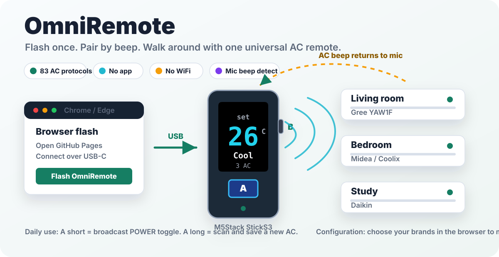
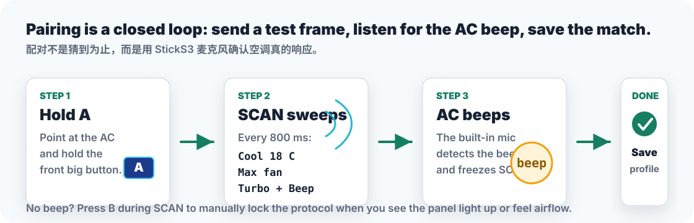
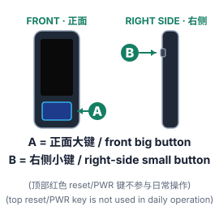

# OmniRemote

> One StickS3, every AC in the house.
> 一根 M5Stack StickS3 控全家空调。

[](LICENSE)
[](https://openbrt.github.io/omniremote/)



## 30 秒看懂

OmniRemote 是一个开源的 **M5Stack StickS3 万能空调红外遥控固件**。烧录后，它会把一根 StickS3 变成全家的空调遥控器：长按配对空调，短按广播开关命令，只有你正对着的那台会收到红外信号。

| 你关心的 | 答案 |
| --- | --- |
| 硬件 | M5Stack StickS3，内置红外发射、屏幕、两个按键和麦克风 |
| 覆盖 | 固件内置 83 个空调协议变体，覆盖 Gree、Midea、Haier、Daikin、Mitsubishi、Hitachi、TCL、Hisense、Panasonic 等 |
| 配对 | 长按 A 进入 SCAN，设备逐个试协议；空调一响，麦克风听到 beep 后自动锁定 |
| 日常 | A 短按把 POWER toggle 广播给所有已保存空调；对准哪台，哪台响应 |
| 联网 | 烧录和配置用浏览器 USB 串口；设备本身不需要 WiFi、账号或 App |

## 马上使用

| 步骤 | 做什么 | 结果 |
| --- | --- | --- |
| 1. 烧录 | 用桌面版 Chrome / Edge 打开 [中文烧录页](https://openbrt.github.io/omniremote/) 或 [English installer](https://openbrt.github.io/omniremote/install-en.html)，接上 StickS3，点连接并烧录 | 固件写入 StickS3 |
| 2. 配对 | 对准空调，长按正面大键 A；听到空调 beep 或看到面板亮起时松手 | 当前协议保存为一个 AC profile |
| 3. 使用 | A 短按广播开关；B 短按滚菜单；B 长按执行温度、模式、风速调整 | 不用手机，不用云端，直接拿着走 |



## 按键速查



| 操作 | 功能 |
| --- | --- |
| A 短按 | 向所有已保存空调广播 POWER toggle |
| A 长按 | 进入 SCAN，配对一台新空调 |
| B 短按 | 滚动 HOME 菜单：温度、模式、风速、已保存 AC |
| B 长按 | 执行当前菜单项并广播 |
| SCAN 中 B 短按 | 对不会 beep 的空调，手动锁定当前协议 |
| A + B 同按 3 秒 | 出厂复位，清空所有 profile |

## 浏览器筛品牌

默认 SCAN 会尝试全部 83 个协议，完整一圈约 80 到 90 秒。如果家里只有一两个品牌，烧录后打开 [配置页](https://openbrt.github.io/omniremote/configure.html)，只勾选你家的品牌，Web Serial 会把品牌 bitmap 写入 NVS。之后 SCAN 只试这些协议，通常几秒就能命中。

配置过程完全离线：电脑通过 USB 串口写入 StickS3，StickS3 不连网。

## 为什么只做空调

空调红外命令不是简单的“按键码”，而是每次把 `mode / temp / fan / power` 打包成品牌私有状态帧。OmniRemote 基于 [IRremoteESP8266](https://github.com/crankyoldgit/IRremoteESP8266) 的空调状态机编码器，所以能直接生成各品牌需要的完整帧。

电视、风扇、投影等非空调协议在没有原遥控器做 A/B 验证时命中率不稳定：不同红外库的 bit-ordering、协议变体和型号差异很容易混淆。空调更适合自动发现，因为很多机型收到有效命令会发出 beep，StickS3 的麦克风可以把“发码 -> 听到响应 -> 锁定协议”闭环做完。

## 硬件

- M5Stack StickS3
- ESP32-S3-PICO-1，8 MB Flash + 8 MB OPI PSRAM
- 内置 IR TX：GPIO 46
- 内置 IR RX：GPIO 42，目前未使用
- 1.14" LCD、A/B 两个按键、ES8311 I2S 麦克风
- 250 mAh 内置电池，USB-C 充电和烧录

不需要外接红外 LED、杜邦线或额外模块。

## 开发者构建

普通用户直接用 [网页烧录器](https://openbrt.github.io/omniremote/)。开发调试走 PlatformIO：

```bash
cd firmware-idf-pure
pio run -t upload
pio device monitor
```

如果要重刷但保留已配空调，网页烧录时不要勾选 `Erase device`；NVS 里的 profiles 和 brand mask 会保留。

## 仓库结构

```text
docs/                 GitHub Pages 网页烧录器、配置页、固件二进制和文档图片
firmware-idf-pure/    当前 ESP-IDF / PlatformIO 固件工程
firmware/             旧版 Arduino/PlatformIO 工程
msc-disk-files/       StickS3 作为 USB 磁盘暴露出来的说明文件
tools/                生成 USB MSC FAT 镜像等辅助脚本
```

## Built with

- [IRremoteESP8266](https://github.com/crankyoldgit/IRremoteESP8266) - AC protocol encoders.
- [M5Unified](https://github.com/m5stack/M5Unified) - M5Stack board abstraction.
- [esp-web-tools](https://github.com/esphome/esp-web-tools) - browser flashing.

## License

[MIT](LICENSE). Use it, modify it, sell it. Pull requests are welcome, especially for new AC brand variants.
